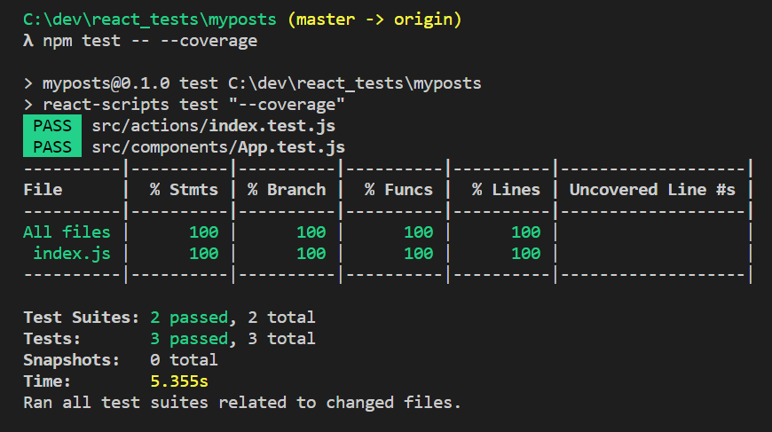

### Tutorial Example

How to create a blog post SPA with React-Redux following [Krunal Lathiya's sample](https://appdividend.com/2018/06/14/how-to-connect-react-and-redux-with-example/).

### Notes on Sample

This was a test if I could build an app without relying on the tutorials. Went pretty straight forward. Still sometimes have to make liberal use of ```debugger``` to watch how properties/state/react store is getting modified and passed around.


[todo] Still need to try reorganizing the Re-Ducks way!

- Added Jest test framework to test.

- Read [redux docs on using Jest](https://redux.js.org/recipes/writing-tests)
- Created some basic tests from samples. 

To get code test coverage reports from Jest do:
```npm test -- --coverage```

the output looks like this:


You can also have the code coverage report spit out in a pretty html file:
```npm test -- --coverage --coverageDirectory=output/coverage/jest```

[todo]: not sure why it thinks I have 100% code coverage???


## How to debug Jest Testing Routines

https://jestjs.io/docs/en/tutorial-react


### How to debug your Jest tests in VS Code

https://jestjs.io/docs/en/troubleshooting
